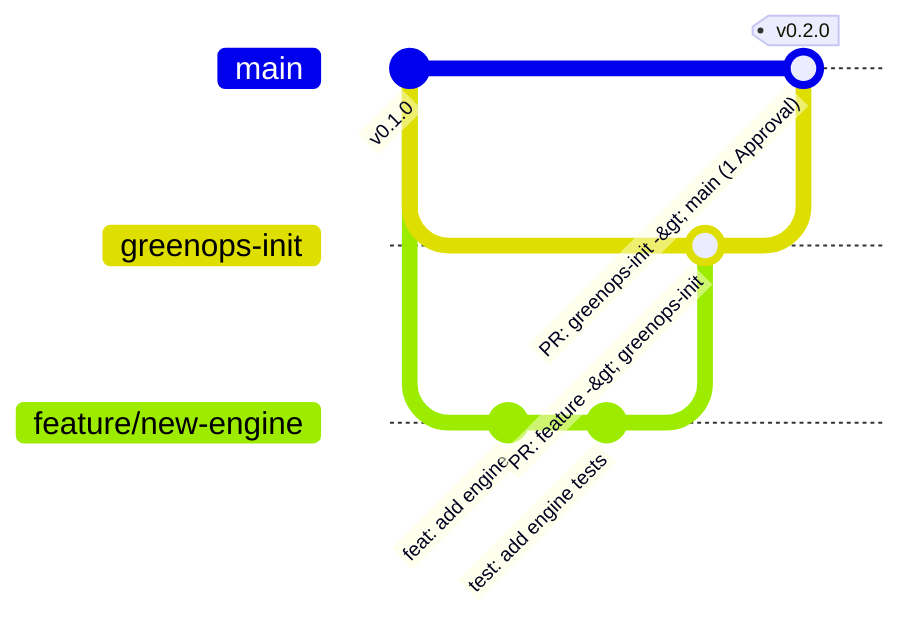

# Contributing & Versioning Guide

Thank you for contributing to **GreenOps / CodeVitals**! To maintain code quality, reliable releases, and clear git history, we follow a reviewed **git branching workflow** and **Conventional Commits** tied to **Semantic Versioning (SemVer)**.

---

## 🌳 1. Git Branching & Protection Rules

### Branch Architecture



### Main-branch review policy

Changes should reach main through a reviewed pull request from greenops-init (or an approved hotfix/release branch). Require at least one maintainer approval before promotion.

The repository includes a source-branch policy workflow, but files alone cannot prove that hosting-service branch protections or required checks are enabled. Repository administrators must verify those settings; do not assume direct pushes are technically blocked.

---

## 📝 2. Standard Development Workflow

### Step 1: Branch from `greenops-init`

```bash
git checkout greenops-init
git pull origin greenops-init
git checkout -b feature/my-new-feature
```

### Step 2: Make Changes & Commit Using Conventional Commits

Write your commit messages following the format specified below:

```bash
git diff
# Stage only the files you reviewed; never stage credentials or local ledgers
git add path/to/changed-file
git commit -m "feat(parser): add support for rust AST parsing"
```

_(Husky's `commit-msg` hook runs Commitlint on every commit; there is no pre-commit hook)._

Before opening a PR, run `pnpm lint`, `pnpm build`, `pnpm test:all` (Vitest plus the MCP Jest suite) and `pnpm format:check`. CI runs the same checks except formatting.

### Documentation is part of each change

Before calling a behavior change complete:

- Update the root README's judge quick start, expected outputs, sample-data provenance and known limitations when affected. Keep one reproducible path that needs no paid API or cloud account.
- Update `docs/development/getting-started.md` for prerequisites, commands and troubleshooting; distinguish root and nested website installation/build.
- Update `docs/architecture/overview.md` for agent capabilities, approval/execution boundaries, adapters and evidence storage.
- Update the website README for navigation, themes, controls and isolated demo behavior.
- Record actual validation date, code baseline, commands, results and untested boundaries in `docs/SUBMISSION.md`. Do not turn targeted tests into a full-suite claim, simulated checks into production savings, or a local build into a clean-install/CI claim.
- Preserve dated review history and add current status notes where old findings have been resolved. Check Markdown links and formatting, and never commit credentials or generated run evidence.

Repository links must identify the branch containing the demonstration. Confirm judge access separately if the repository is private. A documentation checklist does not imply an automatic update service: include the relevant edits in each implementation review.

### Step 3: Push to Origin & Create PR to `greenops-init`

```bash
git push -u origin feature/my-new-feature
```

Open a Pull Request with base: **`greenops-init`**.

### Step 4: Promote `greenops-init` to `main`

When changes in `greenops-init` are tested and ready for production/release:

1. Open a Pull Request from **`greenops-init`** $\rightarrow$ **`main`**.
2. Request a review from at least 1 team maintainer.
3. Once approved and CI checks pass, merge into `main`.

---

## 🏷️ 3. How to Write Commit Titles (Conventional Commits)

Commit titles must follow the **Conventional Commits** structure:

```text
<type>(<optional scope>): <description>

[optional body]

[optional footer(s)]
```

### Allowed Commit Types & Version Impact

| Type       | Description                                     | SemVer Bump                               | Example                                                |
| :--------- | :---------------------------------------------- | :---------------------------------------- | :----------------------------------------------------- |
| `feat`     | A new feature or capability                     | **MINOR** (`0.1.0` $\rightarrow$ `0.2.0`) | `feat(review): add automated PR risk scoring`          |
| `fix`      | A bug fix                                       | **PATCH** (`0.1.0` $\rightarrow$ `0.1.1`) | `fix(git): resolve detached head branch detection`     |
| `perf`     | Performance improvement                         | **PATCH** (`0.1.0` $\rightarrow$ `0.1.1`) | `perf(ast): cache parsed AST trees across scans`       |
| `refactor` | Code refactoring without bug fix or new feature | **PATCH** / None                          | `refactor(core): simplify ledger transaction handler`  |
| `docs`     | Documentation changes only                      | None                                      | `docs: update branching strategy and versioning guide` |
| `style`    | Formatting, missing semicolons, white-space     | None                                      | `style: format imports and run prettier`               |
| `test`     | Adding or updating unit/integration tests       | None                                      | `test(cli): add unit tests for scan command`           |
| `build`    | Build system, toolchain, or dependencies        | None / Patch                              | `build: upgrade turbo to version 2.0.14`               |
| `ci`       | CI/CD workflows and scripts                     | None                                      | `ci: add branch policy and commitlint workflows`       |
| `chore`    | Other maintenance tasks                         | None                                      | `chore: clean up unused test fixtures`                 |
| `revert`   | Reverts a previous commit                       | Patch                                     | `revert: feat(cli): revert experimental flag`          |

### 💥 Breaking Changes (MAJOR Version Bump)

To trigger a **MAJOR** version bump (`0.1.0` $\rightarrow$ `1.0.0` or `1.x.x` $\rightarrow$ `2.0.0`), use an exclamation mark `!` after the type/scope or include `BREAKING CHANGE:` in the commit footer:

```text
feat(cli)!: change default output format from text to json
```

_or_

```text
feat(api): overhaul review scoring endpoints

BREAKING CHANGE: The `greenops review --format json` output schema has been restructured.
```

---

## 🔢 4. Versioning Commands & Monorepo Synchronization

The root pnpm workspace packages follow synchronized versioning. The nested website has its own package.json/package-lock.json and version; it is not included by the root apps/* workspace glob.

### Check Version Consistency

Check versions for packages covered by the repository's version script:

```bash
pnpm version:check
```

### Bump Version Automatically (Based on Git Commits)

Analyzes recent commits and applies the appropriate SemVer bump:

```bash
pnpm version:bump
```

### Manual Version Bumps

```bash
# Bump patch: 0.1.0 -> 0.1.1 (for bug fixes / perf)
pnpm version:patch

# Bump minor: 0.1.0 -> 0.2.0 (for new features)
pnpm version:minor

# Bump major: 0.1.0 -> 1.0.0 (for breaking changes)
pnpm version:major
```

---

## ✅ 5. Examples & Best Practices

### Good Commit Titles

- `feat(cli): add --filter option to scan command`
- `fix(ledger): prevent duplicate transaction recording`
- `docs(readme): add architecture overview diagram`
- `feat(auth)!: require API token for all CLI commands`
- `test(measure): add benchmark tests for AST parsing`

### Invalid Commit Titles (Will be rejected by Git hook / CI)

- ❌ `update stuff` _(Missing type)_
- ❌ `Fixed bug in CLI` _(Type must be lowercase and followed by colon)_
- ❌ `feat: add new feature.` _(No trailing period)_
- ❌ `WIP: working on ledger` _(`WIP` is not an allowed type)_

Imperative mood is recommended but not enforced; subject casing is not checked.
